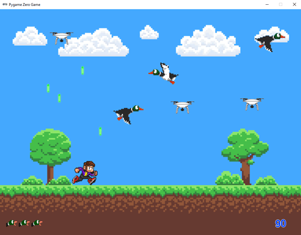

# Drone Hunter

A fun game written in Pygame Zero. Ducks roam the skies enjoying the freedom of flight, unaware of the deadly threat nearby: ill-piloted drones. Your mission is to protect the lives of the ducks by shooting down the drones before they hit the ducks. But beware! Your laser blasts can also hit the ducks, so aim carefully.

## Project Goals
- First of all, to create my very first video game that is fun to play, 
- that looks graphically nice,
- that uses code that can be easily understood and extended,
- and that illustrates useful programming techniques.

## Game Features
- Colourful 8-bit style graphics
- Sprite animation
- A score counter on screen
- Indication of remaining duck lives on screen
- Your score and the highest score are shown when the game is over
- High Score storage in a file
- Built-in Timer to limit playtime 

## Dependencies
- Python 3
- pgzero

## Running from console:
- Install Dependencies: `pip install pgzero`
- Play the game: `python dronehunter.py`

## INSTRUCTIONS
### Controls
- Press Enter to start game.
- Move left and right using Left and Right arrow keys.
- Push an arrow key repeatedly to increase your speed.
- Space Bar to fire laser.

### Gameplay
- Ducks fly across the screen. If they hit a drone a duck life is lost. You start with 6 duck lives.
- You have a laser with which you can shoot down the drones.
- If you hit a duck with your laser blast that costs a duck life. 
- When you have no duck lives left, the game ends.
- To prevent you from playing too long the game includes a timer that ends the game after 5 minutes (300 sec).

### Scoring
For shooting a drone 30 points are awarded when there are 3 ducks on screen, 20 with 2 ducks on screen and 10 with only one duck on screen.

## Suggested Tweaks
As you have full access to the source code many options are available to tweak the gameplay as you prefer. You could:
- Change the number of ducks, drones or duck lives,
- Change the speed and directions of drones, ducks and laser blasts to make the game easier or harder,
- Change the scoring system,
- Replace the sprites with your own sprites,
- Change the maximum playtime.

## Suggested Enhancements 
- A Level Structure
- Powerups
- More animations
- A game pause button
- Add Sounds & Music
